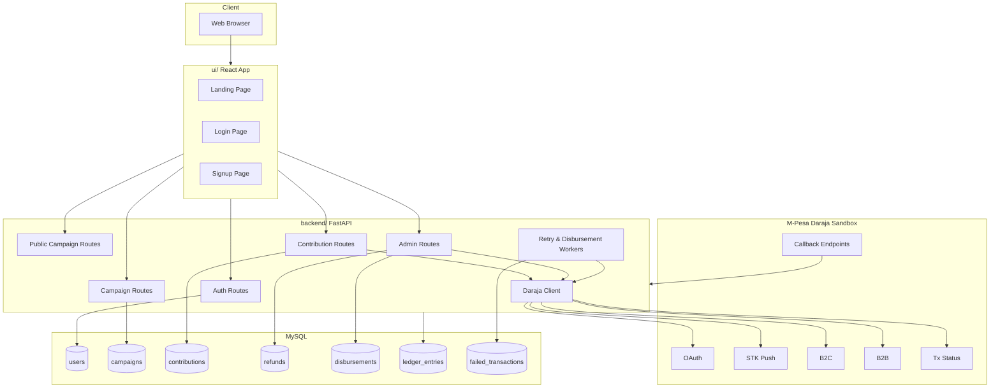

# LipaTrust Monorepo

LipaTrust is a crowdfunding product with:
- Public campaign discovery and share links
- Account signup/login
- Contribution via M-Pesa STK Push
- Admin verification, refunds, disbursement, and monitoring APIs

## Repository Layout

```text
lipa_trust_system/
├── backend/   # FastAPI + SQLAlchemy + Daraja integration
└── ui/        # React + Vite frontend (landing, login, signup)
```

## Requirements

- Python 3.11+
- Node.js 18+
- npm 9+
- MySQL 8+ (or compatible MySQL endpoint)
- `uv` for Python dependency management
- Public HTTPS callback URLs for Daraja sandbox testing (for example with ngrok or a deployed domain)

## Product Flow

1. User lands on `/` and discovers campaigns.
2. Shared campaign links open directly via `/?campaign=<id>`.
3. User signs up or logs in.
4. User contributes to a campaign via STK Push.
5. Backend receives callback and updates status/ledger.
6. Admin endpoints handle verification, refunds, and operational monitoring.

## Architecture



## Concurrency and Consistency

- Row-level locks (`with_for_update`) protect critical money-state transitions.
- Callback processing is idempotent (receipt + checkout reference handling).
- Status-based processing (`PENDING/PROCESSING/COMPLETED/FAILED`) reduces race conditions.
- Retry/reconciliation workers handle stale transaction states.
- Failed transaction records support audit and replay workflows.

## Local Development

### 1) Backend

```bash
cd backend
cp .env.example .env
uv venv
source .venv/bin/activate
uv sync
uv run python create_tables.py
uvicorn main:app --reload --port 8000
```

### 2) Frontend

```bash
cd ui
npm install
npm run dev
```

Open frontend URL shown by Vite (usually `http://localhost:5173`).

## Production Deployment

See:
- [Backend Deployment](/home/bealthguy/Public/lipa_trust_system/backend/README.md)
- [UI Deployment](/home/bealthguy/Public/lipa_trust_system/ui/README.md)

## Notes

- Keep `MPESA_MODE=mock` for offline dev without Daraja.
- Set `MPESA_MODE=sandbox` for integration testing with real sandbox credentials.
